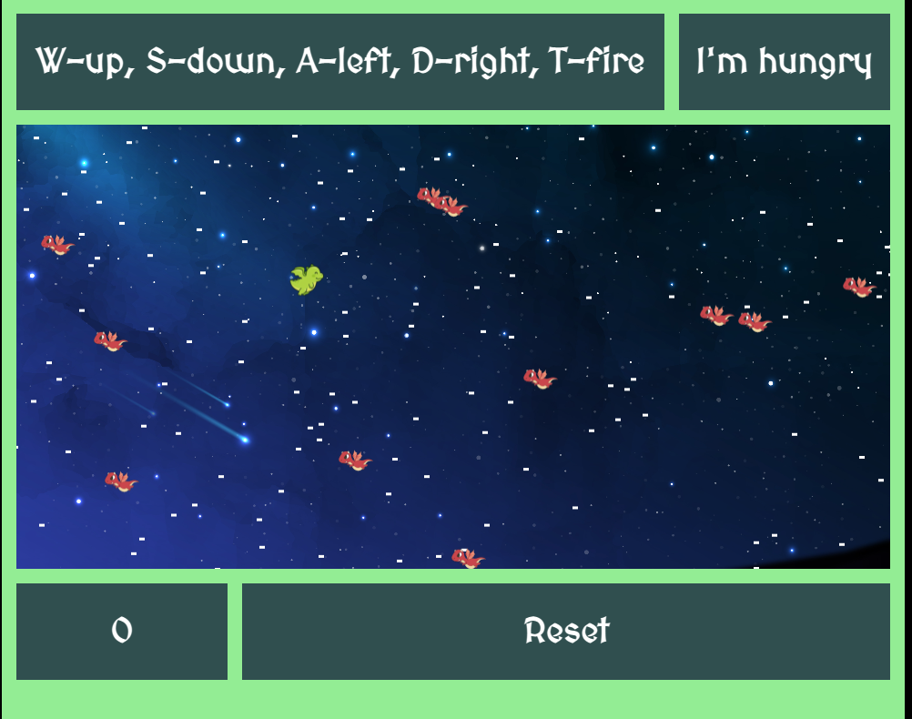

# Dragon Flight

Welcome to Dragon Flight!

This is a flight game where the player navigates a dragon around the screen dodging other dragons and
collecting food.

Eat food along the way to score.

If you make it to the finish line you win!

press w for up, s for down, a for left and d for right ... pst (don't tell anyone but the t button will allow you to breath fire)

# Aproach

My approach to building this game was to start with basic functionality including directing the player, generating enemies and fruit and detecting collisions.  Once the bulk of the game was up and running I began to think more about how fast characters should move, how many enemies there should be and how they should look.  Then I started adding extra styling and slowed down the movement of the fruit.  Finally, I added the easter egg... the dragon breathes fire!

# Tech stack

This game uses html, css and javascript.
The game is built using html canvas.

# game footage

# MVP

+ player should be able to navigate the dragon up and down

+ randomly generated dragons should move from right to left

+ randomly generated food should move from right to left

+ detect collision with dragons

+ detect collision with food

+ Notify player when game is over

# Stretch

+ add one point when player collides with food

+ track score

+ style game

# Post project reflection

I really enjoyed building this project.  There were a few small roadblocks that I encountered, but nothing to difficult.

One aspect of building the game that was suprisingly challenging was adding the animation to the game.  I was very happy with the way it turned out.

I feel that my syling abilities improved during the course of this project.

# Sources used

I watched a few tutorials on html canvas games, however I did not end up using the information to build this game, mainly because tips and advice that I got from other engineers proved to be more usefull for solving the problems that I ran into.

I found this tutorial from w3 to be usefull for adding images
https://www.w3schools.com/graphics/game_images.asp

Credit for background picture
<a href="http://www.freepik.com">Designed by Freepik</a>
